<div align="center">

# dots

**Hyprland + Quickshell rice with wallpaper-derived colors and an always-on Claude resident**


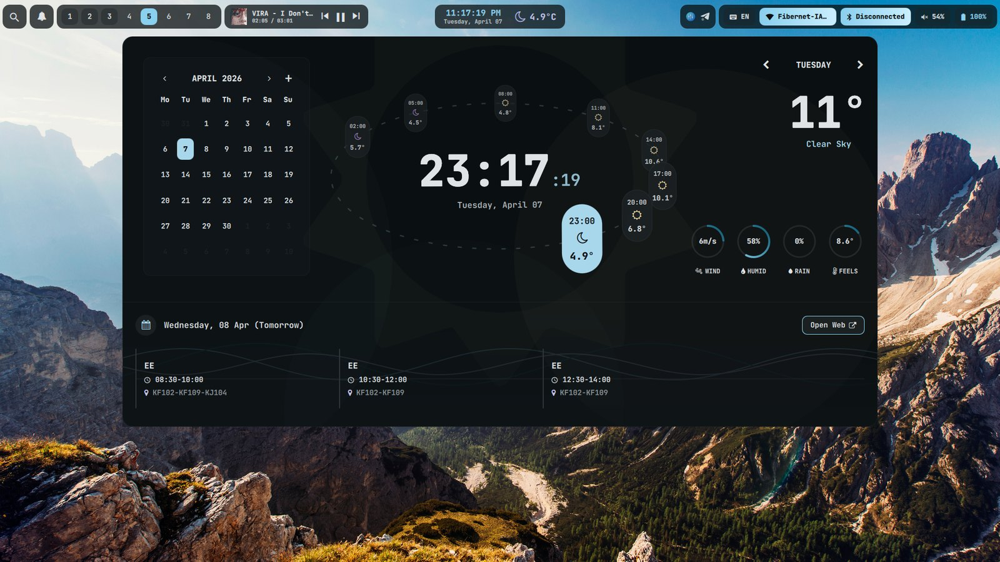

</div>

---

## Top bar

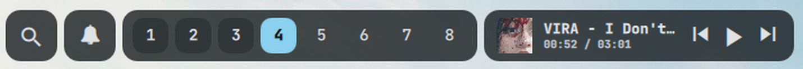

<table>
<tr>
<td width="38%">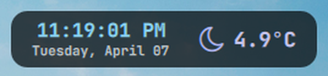</td>
<td>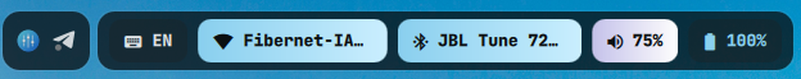</td>
</tr>
</table>

Every pill has a **hover card** that grows out of it (forecast, agenda, mixer, device list, etc.) and an optional **ambient background**: liquid battery fill, wifi radar, a sky that follows the time and weather, CPU load area, network particles. Details in [docs/topbar.md](docs/topbar.md).

## Widgets

<table>
<tr>
<td width="50%">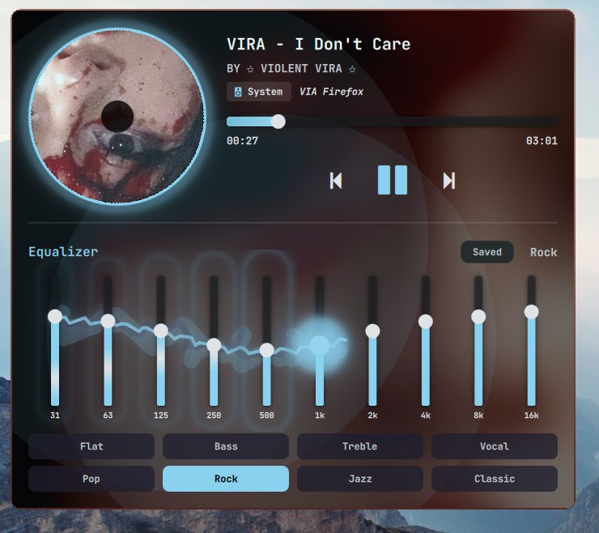<br><sub><b>Music</b>: MPRIS player, 10-band EQ with presets · <kbd>Super</kbd>+<kbd>M</kbd></sub></td>
<td width="50%">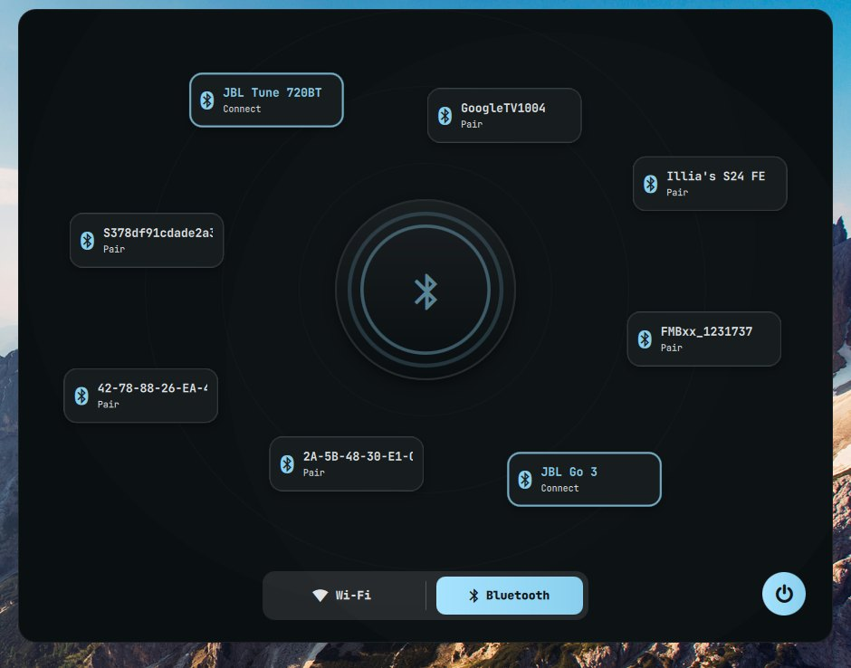<br><sub><b>Network</b>: Wi-Fi and Bluetooth radar · <kbd>Super</kbd>+<kbd>N</kbd></sub></td>
</tr>
<tr>
<td>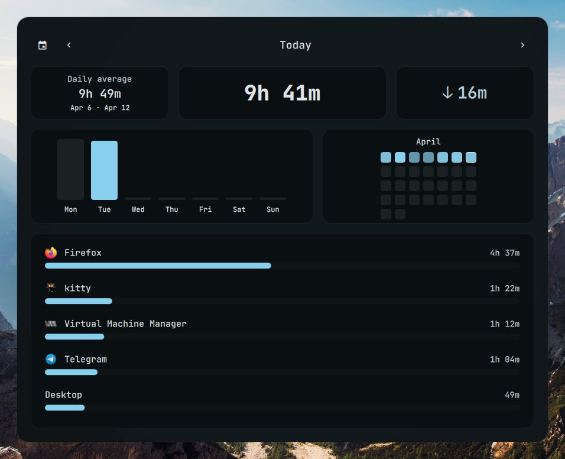<br><sub><b>Focus time</b>: per-app screen time, weekly history · <kbd>Super</kbd>+<kbd>Shift</kbd>+<kbd>T</kbd></sub></td>
<td>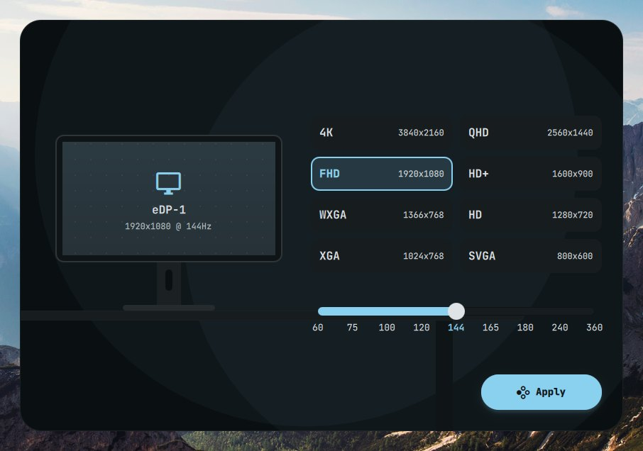<br><sub><b>Monitors</b>: resolution and refresh picker · <kbd>Super</kbd>+<kbd>Shift</kbd>+<kbd>M</kbd></sub></td>
</tr>
</table>

<table>
<tr>
<td width="33%">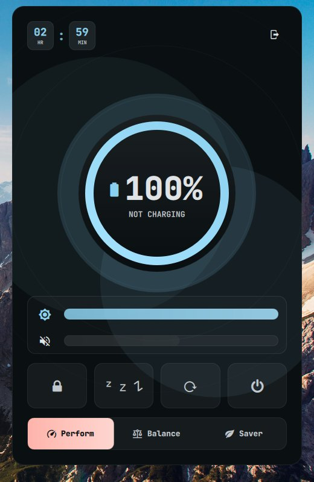<br><sub><b>Battery</b>: power profiles, brightness · <kbd>Super</kbd>+<kbd>B</kbd></sub></td>
<td width="33%">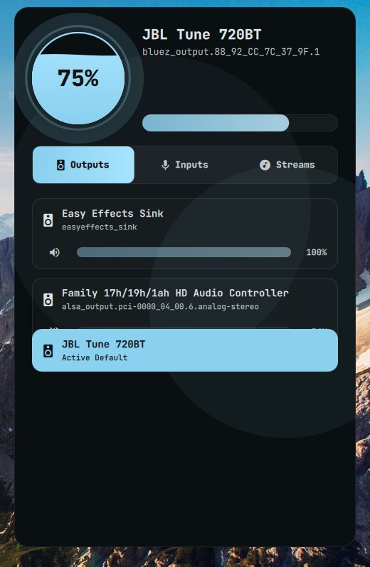<br><sub><b>Volume</b>: outputs, inputs, per-app streams · <kbd>Super</kbd>+<kbd>Shift</kbd>+<kbd>V</kbd></sub></td>
<td width="33%">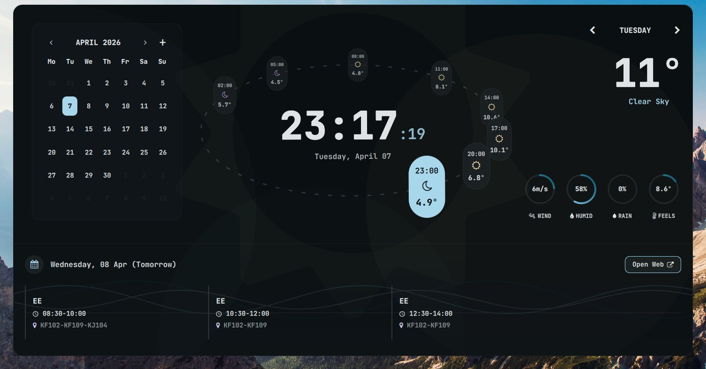<br><sub><b>Calendar</b>: month view, hourly weather arc, agenda · <kbd>Super</kbd>+<kbd>Shift</kbd>+<kbd>X</kbd></sub></td>
</tr>
</table>

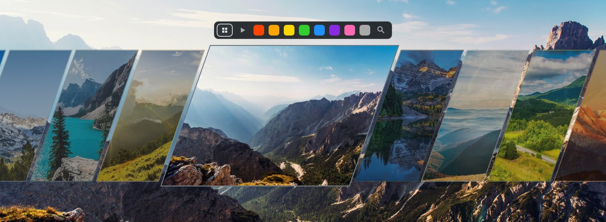
<sub><b>Wallpaper picker</b>: color filters; picking one re-themes the whole shell through matugen · <kbd>Super</kbd>+<kbd>W</kbd></sub>

Full list with notes: [docs/widgets.md](docs/widgets.md).

## Highlights

| | |
|---|---|
| 🎨 **Wallpaper colors** | matugen turns the wallpaper into `qs_colors.json`. Every QML file hot-reloads it within a second. |
| 🧠 **Claude resident** | Morning/night briefs, "while you were away" catch-up, proactive fix suggestions, screenshot Q&A. It shows up as cards under the clock pill. |
| 🔒 **Lock screen** | Blurred parallax backdrop, rolling clock, now-playing, and an animated password ring. The PAM path is unchanged. |
| 🗂️ **Smart workspaces** | Names and icons come from the apps on each workspace. Saves and restores layouts. |
| 🍃 **Eco mode** | Throttles or freezes unfocused background apps. It never touches anything playing audio. |
| ⚡ **Leak-proof processes** | Every long-lived watcher goes through `lifeline.sh`, and `leak_reaper.py` backs it up. |

## Docs

| Page | What's in it |
|---|---|
| [Installation](docs/installation.md) | Dependencies, where to clone, first launch |
| [Keybindings](docs/keybindings.md) | All binds, generated from `hyprland.conf` |
| [Widgets](docs/widgets.md) | Every popup: size, keybind, source file |
| [Top bar](docs/topbar.md) | Pills, hover cards, background effects, timer |
| [Architecture](docs/architecture.md) | Process model, IPC, colors, scaling (with diagrams) |
| [Settings](docs/settings.md) | `settings.json` reference |
| [Claude resident](docs/claude-resident.md) | Cards, briefs, catch-up, fixes, mailbox |
| [Performance](docs/performance.md) | Eco mode, lifeline, leak reaper, power tweaks |

## Layout

```
~/.config/hypr/
├── hyprland.conf  exec.conf  hypridle.conf  polish.conf   Hyprland config
├── settings.json                                          shell settings (hot-reloaded)
├── eco/  smartws/                                         eco-mode + smart-workspace rules
├── docs/                                                  you are here
└── scripts/
    ├── qs_manager.sh                                      widget IPC gateway
    ├── *.sh / *.py                                        daemons, toggles, helpers
    └── quickshell/
        ├── Main.qml  TopBar.qml  Lock.qml  *Osd.qml       shell entry points
        ├── WindowRegistry.js                              popup sizes + positions
        └── <widget>/                                      one folder per popup
```

<div align="center"><sub>The popup screenshots date from April 2026, before the top-bar and Guide overhaul. Screenshots are regenerated with <code>scripts/docs/capture.sh</code>. See <a href="docs/installation.md#refreshing-screenshots">Refreshing screenshots</a>.</sub></div>
