<div align="center">

# dots

**Hyprland + Quickshell rice with wallpaper-derived colors and an always-on Claude resident**


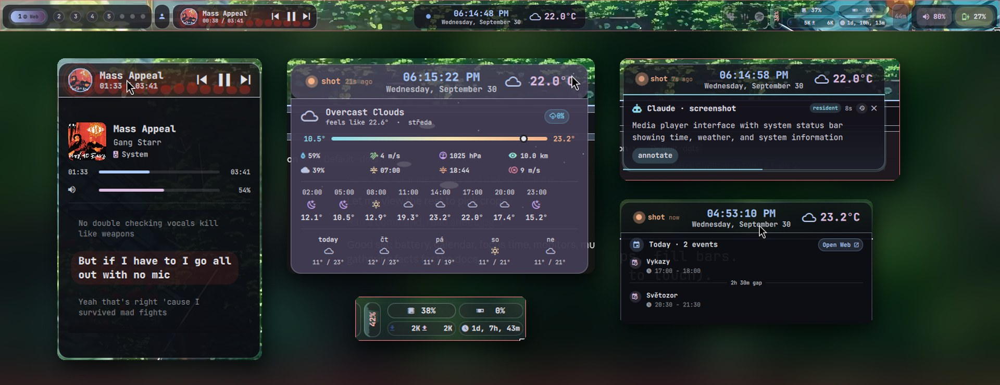

<sub>Real captures: the top bar and its hover cards, arranged side by side.</sub>

</div>

---

## Top bar

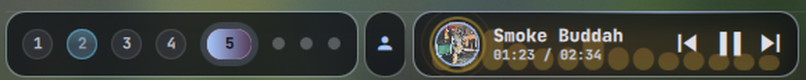

<table>
<tr>
<td width="42%">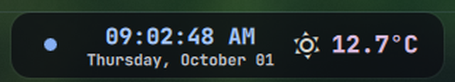</td>
<td>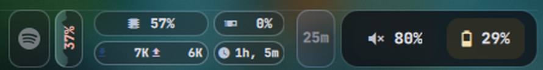</td>
</tr>
</table>

Each pill opens a **hover card** that grows out of it. Pills can also have an **ambient background** behind their content (liquid battery, wifi radar, a time-of-day sky, CPU load area, network particles). See [docs/topbar.md](docs/topbar.md).

<table>
<tr>
<td width="28%" valign="top">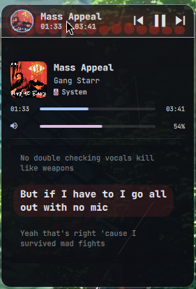<br><sub><b>Media</b>: player, volume, synced lyrics</sub></td>
<td width="42%" valign="top">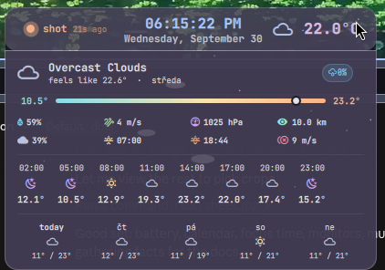<br><sub><b>Weather</b>: conditions, hourly, 5-day</sub><br><br>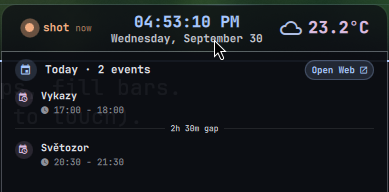<br><sub><b>Clock</b>: today's agenda with gaps</sub></td>
<td width="30%" valign="top">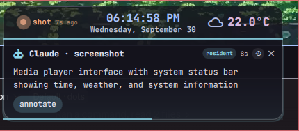<br><sub><b>Resident card</b>: Claude answers under the clock</sub><br><br>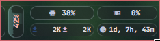<br><sub><b>Stats chips</b>: CPU, GPU, net, uptime, shell CPU</sub></td>
</tr>
</table>

## Guide · "Imperative"

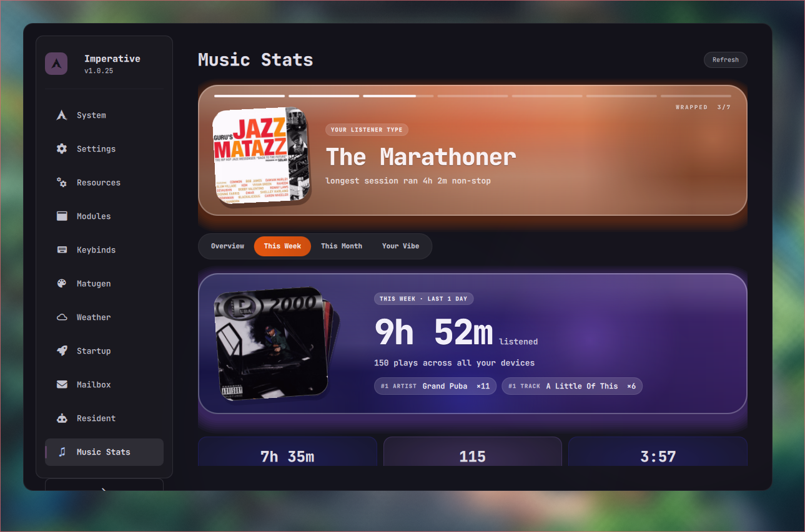

<table>
<tr>
<td width="50%">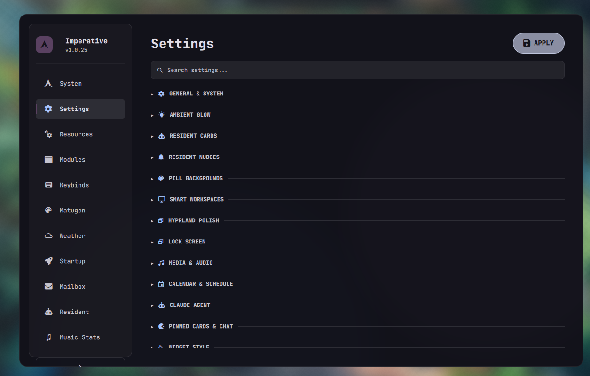<br><sub><b>Settings</b>: every <code>settings.json</code> key, searchable, by category</sub></td>
<td width="50%">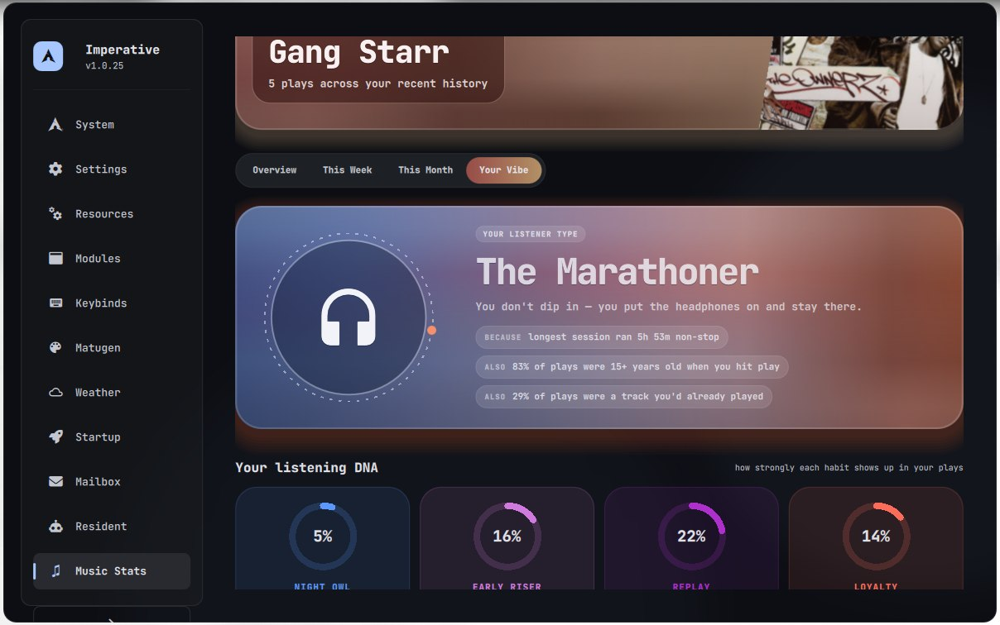<br><sub><b>Your Vibe</b>: listener type and listening DNA</sub></td>
</tr>
</table>

<kbd>Super</kbd>+<kbd>Shift</kbd>+<kbd>H</kbd>. The sidebar holds System, Settings, Resources, Modules, Keybinds, Matugen, Weather, Startup, Mailbox, Resident and Music Stats.

## Claude resident

<table>
<tr>
<td width="50%">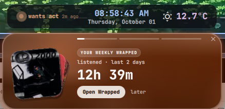</td>
<td width="50%">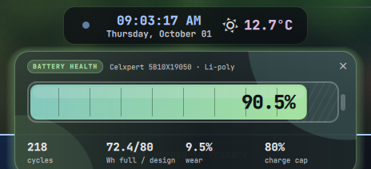</td>
</tr>
<tr>
<td>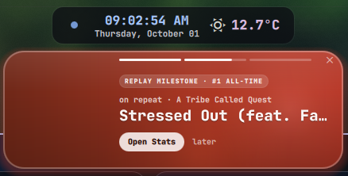</td>
<td>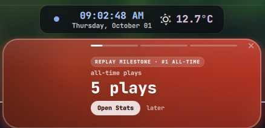</td>
</tr>
</table>

Cards drop under the clock pill for a weekly wrapped, battery health, songs on repeat, replay milestones, briefs and more. <kbd>Super</kbd>+<kbd>`</kbd> opens **Claude Ask**:

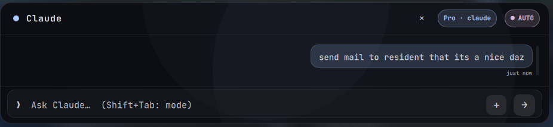

More in [docs/claude-resident.md](docs/claude-resident.md).

## Lock screen

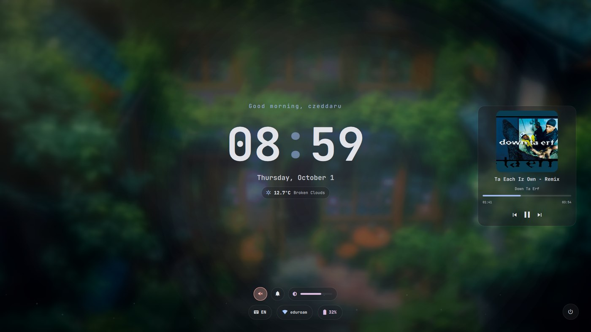
<sub>Blurred wallpaper with parallax, rolling clock, greeting, weather, now playing. Preview it safely with <code>lock_test.sh</code>.</sub>

## Widgets

<table>
<tr>
<td width="50%"><br><sub><b>Music</b>: vinyl cover, 10-band EQ, presets, saved curves · <kbd>Super</kbd>+<kbd>M</kbd></sub></td>
<td width="50%"><br><sub><b>Network</b>: Wi-Fi and Bluetooth radar · <kbd>Super</kbd>+<kbd>N</kbd></sub><br><br><br><sub><b>Monitors</b>: resolution and refresh picker · <kbd>Super</kbd>+<kbd>Shift</kbd>+<kbd>M</kbd></sub></td>
</tr>
</table>

<table>
<tr>
<td width="33%"><br><sub><b>Battery</b>: power profiles, brightness · <kbd>Super</kbd>+<kbd>B</kbd></sub></td>
<td width="33%"><br><sub><b>Volume</b>: outputs, inputs, per-app streams · <kbd>Super</kbd>+<kbd>Shift</kbd>+<kbd>V</kbd></sub></td>
<td width="33%"><br><sub><b>Focus time</b>: per-app screen time · <kbd>Super</kbd>+<kbd>Shift</kbd>+<kbd>T</kbd></sub></td>
</tr>
</table>


<sub><b>Calendar</b>: month view, hourly weather arc, agenda · <kbd>Super</kbd>+<kbd>Shift</kbd>+<kbd>X</kbd></sub>


<sub><b>Wallpaper picker</b>: color filters; picking one re-themes the whole shell through matugen · <kbd>Super</kbd>+<kbd>W</kbd></sub>

Full list with notes: [docs/widgets.md](docs/widgets.md).

## Highlights

| | |
|---|---|
| 🎨 **Wallpaper colors** | matugen turns the wallpaper into `qs_colors.json`. Every QML file hot-reloads it within a second. |
| 🧠 **Claude resident** | Morning/night briefs, "while you were away" catch-up, proactive fix suggestions, screenshot Q&A. It shows up as cards under the clock pill. |
| 🔒 **Lock screen** | Blurred parallax backdrop, rolling clock, now-playing, and an animated password ring. The PAM path is unchanged. |
| 🗂️ **Smart workspaces** | Names and icons come from the apps on each workspace. Saves and restores layouts. |
| 🍃 **Eco mode** | Throttles or freezes unfocused background apps. It never touches anything playing audio. |
| ⚡ **Leak-proof processes** | Every long-lived watcher goes through `lifeline.sh`, and `leak_reaper.py` backs it up. |

## Docs

| Page | What's in it |
|---|---|
| [Installation](docs/installation.md) | Dependencies, where to clone, first launch |
| [Keybindings](docs/keybindings.md) | All binds, generated from `hyprland.conf` |
| [Widgets](docs/widgets.md) | Every popup: size, keybind, source file |
| [Top bar](docs/topbar.md) | Pills, hover cards, background effects, timer |
| [Architecture](docs/architecture.md) | Process model, IPC, colors, scaling (with diagrams) |
| [Settings](docs/settings.md) | `settings.json` reference |
| [Claude resident](docs/claude-resident.md) | Cards, briefs, catch-up, fixes, mailbox |
| [Performance](docs/performance.md) | Eco mode, lifeline, leak reaper, power tweaks |
| [Fleet](docs/fleet.md) | Phone app, remote control, file relay, Tailscale key card |

## Layout

```
~/.config/hypr/
├── hyprland.conf  exec.conf  hypridle.conf  polish.conf   Hyprland config
├── settings.json                                          shell settings (hot-reloaded)
├── eco/  smartws/                                         eco-mode + smart-workspace rules
├── docs/                                                  you are here
└── scripts/
    ├── qs_manager.sh                                      widget IPC gateway
    ├── *.sh / *.py                                        daemons, toggles, helpers
    └── quickshell/
        ├── Main.qml  TopBar.qml  Lock.qml  *Osd.qml       shell entry points
        ├── WindowRegistry.js                              popup sizes + positions
        └── <widget>/                                      one folder per popup
```

<div align="center"><sub>Screenshots from September–October 2026, except focus time and monitors (April 2026). Popup screenshots are regenerated with <code>scripts/docs/capture.sh</code>. See <a href="docs/installation.md#refreshing-screenshots">Refreshing screenshots</a>.</sub></div>
