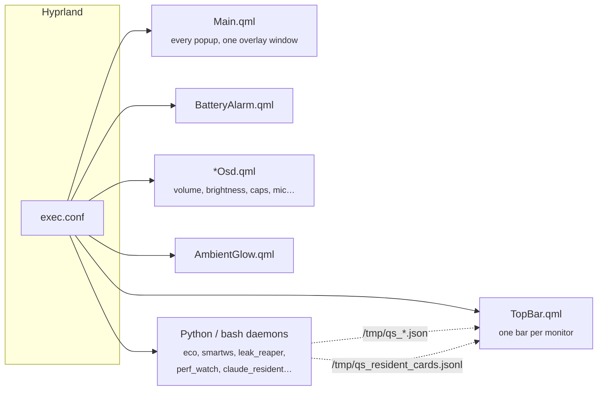
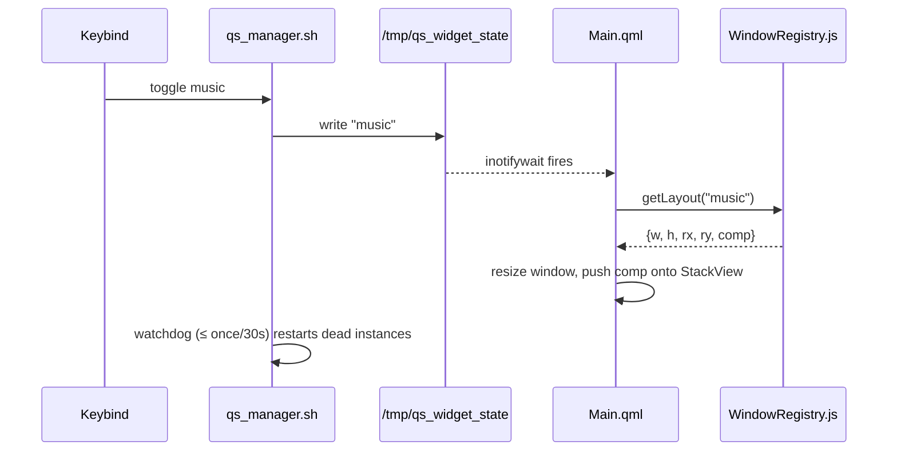
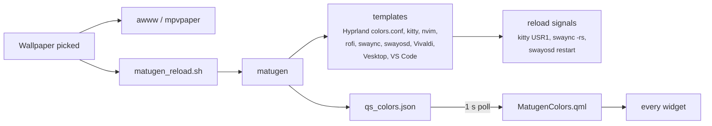

# Architecture

## Processes

The shell is not one process. It's a handful of independent `quickshell -p <file>` instances, all started from `exec.conf`, so one crashing doesn't take the others down.



| Process | Entry | Role |
|---|---|---|
| Main | `scripts/quickshell/Main.qml` | Hosts every popup in a `StackView` in a single overlay-layer window. Preloads about 15 components in the background. |
| TopBar | `scripts/quickshell/TopBar.qml` | `Variants { model: Quickshell.screens }`, one bar per screen. Hover cards, resident cards, timer. |
| BatteryAlarm | `scripts/quickshell/BatteryAlarm.qml` | Low-battery takeover. |
| OSDs | `VolumeOsd.qml`, `BrightnessOsd.qml`, `CapsOsd.qml`, … | Small separate processes. They restart independently. |
| Lock | `scripts/quickshell/Lock.qml` | Launched by `lock.sh`. `LockLegacy.qml` is the fallback. |

## Widget IPC

Keybinds never talk to QML directly. They go through one shell script and one file:



- The current widget is mirrored to `/tmp/qs_active_widget`, so `toggle` knows whether to close.
- `qs_manager.sh toggle <widget> <arg>` writes `widget:arg`. For example, `toggle quicktell voice` writes `quicktell:voice`.
- `qs_manager.sh <N>` and `qs_manager.sh <N> move` also handle workspace switching, so popups close cleanly on switch.

Other file-based channels you'll see:

| File | Direction | Used by |
|---|---|---|
| `/tmp/qs_alttab_nav` | `alttab_monitor.py` → overview | `next` / `confirm` / `close` for <kbd>Alt</kbd>+<kbd>Tab</kbd> |
| `/tmp/qs_workspaces.json` | `workspaces.sh` → bar | Workspace pills |
| `/tmp/qs_resident_cards.jsonl` | any producer → bar | Resident card queue |
| `/tmp/qs_timer.json`, `/tmp/qs_timer_cmd` | bar ↔ CLI | Timer pill state and control |
| `/tmp/qs_eco_state.json` | `eco_daemon.py` → bar | Eco tints and the workspace card |
| `/tmp/qs_smartws_cmd` | CLI → `smartws.py` | Layout save / restore / rename |
| `/tmp/qs_perf.json` | `perf_watch.py` → bar | Quickshell CPU chip |
| `/tmp/qs_topbar_test_flourish` | you → bar | Preview any pill effect (`skyfx`, `wififx`, `cpufx`, …) |

## Colors



`MatugenColors.qml` exposes Catppuccin-style names (`base`, `mantle`, `text`, `surface0–2`, `overlay0–2`, `blue`, `mauve`, `peach`, …) and falls back to Mocha if the JSON is missing.

```qml
MatugenColors { id: _theme }
readonly property color base: _theme.base
```

> [!IMPORTANT]
> The names are just slots. On a warm wallpaper, `blue`, `mauve` and `yellow` can all come out amber. When color has to *mean* something (the power menu's lock / sleep / reboot / shutdown glows, for example), use fixed hex values: `#b4befe`, `#89dceb`, `#fab387`, `#f38ba8`.

## Scaling

`Scaler.qml` derives a factor from the screen width against 1920: `pow(r, 0.85)` below that, `pow(r, 0.5)` above. Then it multiplies by `uiScale` from `settings.json`, hot-reloaded.

```qml
Scaler { id: scaler; currentWidth: Screen.width }
function s(val) { return scaler.s(val) }
// use root.s(48) instead of 48 everywhere
```

## Settings flow

`settings.json` is watched with `inotifywait` by `Main.qml`, `Scaler.qml` and `settings_watcher.sh`. The watcher fans out side effects such as `hypr_polish_apply.sh` (animations, dim, border accents) and writes them to `polish.conf`. Everything is edited from the Guide's settings tab. See [settings.md](settings.md).
