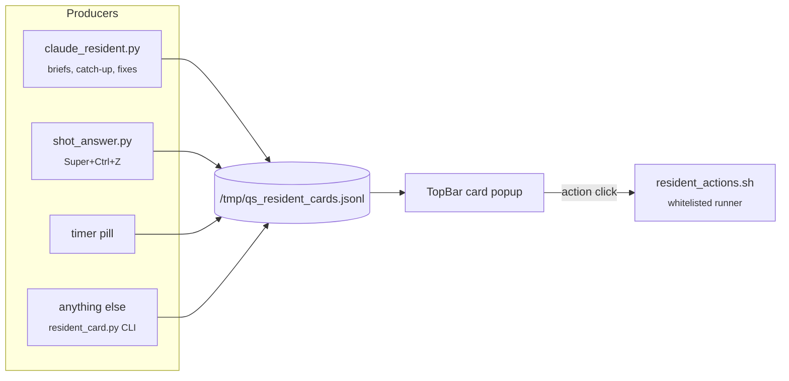

# Claude resident

A set of daemons under `scripts/quickshell/claude/` that keep Claude running alongside the desktop. It talks to you mostly through **cards** that drop under the clock pill, and optionally out loud through `espeak`.



## Cards

The queue is `/tmp/qs_resident_cards.jsonl`, an append-only file with one JSON object per line.

| Field | |
|---|---|
| `id` | Emitting again with the same id replaces the card in place |
| `title`, `body`, `icon` | Content. The body scrolls past about 40% of screen height |
| `urgency` | `low` / `normal` / `high`, which sets the glow color |
| `hold_secs` | `0` means stay until dismissed. Otherwise it auto-dismisses; the timer pauses while hovered |
| `actions` | `[{label, cmd}]` buttons |
| `source` | Who sent it |

Emit one from anywhere:

```bash
python3 ~/.config/hypr/scripts/quickshell/claude/resident_card.py \
    --title "Build done" --body "All green." --hold 10 \
    --action "Open log=kitty less /tmp/build.log"
```

Several cards stack with a `+N` badge and arrows. <kbd>Esc</kbd>, middle-click or the ✕ dismisses one.

## Behaviors

| Behavior | Setting | What it does | Dry run |
|---|---|---|---|
| Morning / afternoon / night brief | `residentMorningBrief`, … | Weather, agenda, battery, notifications, pending nudges. Once per window, only while you're at the PC | `resident_extras.py --test-brief` |
| Catch-up | `residentCatchUp` | After 2+ min away: new notifications, downloads, git changes, battery delta. Also feeds the lock screen's Claude line through `/tmp/qs_lock_brief.json` | `--test-catchup` |
| Proactive fixes | `residentProactiveFixes` | Every ~10 min, 6 h cooldown per fix: full disk, hung processes, memory hogs, failed user units, updates, battery health. **Only proposes.** sudo commands go to the clipboard, never run | `--test-fixes` ⚠ scans your real machine |
| Screenshot Q&A | `screenshotAnswerOutput` | <kbd>Super</kbd> <kbd>Ctrl</kbd> <kbd>Z</kbd>: region → Claude → card and/or notification | — |

## Mailbox

`/tmp/qs_claude_mailbox.json`, exposed as the `mailbox_post` / `mailbox_read` MCP tools, is a shared log for every Claude session working in this repo. Read it when you start, and post a one-liner when you finish something. The full convention is in `scripts/quickshell/claude/AGENT.md`. Card kinds are listed in `CARD_KINDS.md`.

## Dev loop

```bash
bash ~/.config/hypr/scripts/quickshell/claude/qsdev.sh status     # what's alive
bash ~/.config/hypr/scripts/quickshell/claude/qsdev.sh resident   # restart the resident
bash ~/.config/hypr/scripts/quickshell/claude/qsdev.sh log        # tail the debug log
```
