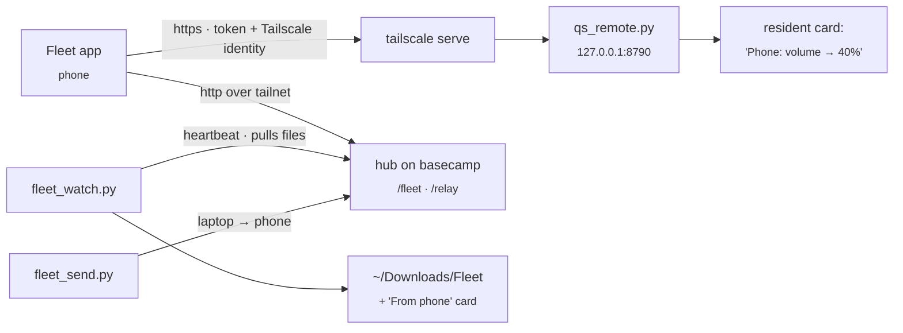

# Fleet: phone app, remote control, file relay

The **Fleet** Android app ([cybutr/fleet-app](https://github.com/cybutr/fleet-app)) controls this laptop and shows every machine on the tailnet. This page covers the laptop's side. The app and the hub on basecamp live in that repo.

## What runs on the laptop

| Piece | Does |
|---|---|
| `scripts/quickshell/claude/qs_remote.py` | The phone's API: `/api/v1/state` (volume, mute, mic, brightness, night light, power profile, battery, Wi-Fi, Bluetooth, do not disturb, stay awake, workspaces, keyboard layout, now playing with album colours and BPM), `/api/v1/art`, `/api/v1/action/<name>`, `/api/v1/binds` and `/api/v1/answer`. It also serves the small `/m` browser page as a fallback. Most actions show a low-key "Phone: …" card, and all go to `~/.local/state/qs-remote/audit.jsonl`. |
| `scripts/quickshell/claude/qs_stream.py` | The screen stream: `/api/v1/stream` signaling and one capture + WebRTC worker per viewing session. See [Screen streaming](#screen-streaming). |
| `scripts/quickshell/claude/qs_remote_input.py` | The touchpad and keyboard: a WebSocket at `/api/v1/input`. Pointer moves, clicks, scrolls and keys go to ydotoold's socket as raw input events, and text goes through `wtype`. |
| `scripts/quickshell/claude/fleet_watch.py` | Pushes the laptop's heartbeat to the hub, writes `/tmp/qs_fleet.json` for the bar, and **pulls files the phone sent** into `~/Downloads/Fleet` with a "From phone" card (Open / Show in folder). |
| `scripts/quickshell/claude/fleet_send.py FILE` | Sends a file to the phone. Also in the palette as **Send a file to the phone**. |

## Set up once

The touchpad needs ydotoold running. On Arch it is a user service: `systemctl --user enable --now ydotool` (skip it if `pgrep ydotoold` already shows one). Typing works best with `wtype` installed (`sudo pacman -S wtype`), which handles any keyboard layout and Unicode.

1. Expose qs-remote on the tailnet: `tailscale serve --bg 8790`.
2. Give the phone a hub token. Add `phone:<token>` to the hub's `FLEET_DEVICE_TOKENS`, and add `FLEET_TOKEN_PHONE=<token>` to `~/.local/state/fleet/tokens.env`. To generate one: `python3 -c 'import secrets; print(secrets.token_urlsafe(32))'`.
3. Pair: palette › **Pair the Fleet app** (or `python3 scripts/quickshell/claude/qs_remote.py pair`). Open the `fleet://setup?…` link on the phone. The link contains tokens, so don't paste it into chats.

## Switches

| `settings.json` | Default | |
|---|---|---|
| `qsRemoteEnabled` | `true` | Kill switch, read on every request, so no restart is needed. Also in the palette as "Phone remote control". |
| `qsRemoteRequireIdentity` | `true` | Reject requests without a Tailscale identity header. Tagged nodes (the VPS, the Windows box) never send one. |
| `qsRemoteAllowedLogins` | `[]` | If set, only these Tailscale logins are allowed. |
| `qsRemoteInputEnabled` | `true` | Touchpad, keyboard and keybinds. Checked on every message, so turning it off cuts a live session immediately. Also in the palette as "Phone touchpad & keyboard". |
| `qsRemoteStreamEnabled` | `true` | Screen streaming. Polled every second during a session, so turning it off cuts a live stream within a second. |
| `qsRemoteStreamEncoder` | `auto` | `auto` (VA, then NVENC, then x264), or force `va`, `nvenc` or `x264`. |

## What the phone can do

- **Controls:**
  - media, volume and brightness (both follow the slider live), mute, mic
  - night light, power profile
  - Wi-Fi, Bluetooth, do not disturb, stay awake (pauses hypridle)
  - switch workspace, screen on/off, screenshot to the phone, next keyboard layout
  - open a widget, lock, notify, show a card
  - scratchpad (the `magic` special workspace), eco mode, Claude quiet, the "yo kandor" wake word
- **Palette:** the search bar at the top of Controls. `/api/v1/palette` takes `{"q", "ask"}` and returns matching rows from the laptop's own palette index (`palette_index.py`), plus a Claude route when `ask` is true. `/api/v1/palette/run` takes `{"id", "arg", "confirm"}` and runs a row by id; dangerous rows need `confirm`. Free text only goes to rows built for it (ask Claude, Spotify search, open a site, open an app on a workspace, rename a workspace, mail search), and the remote's own switches and `fleet.*` rows can't be run from the phone. It is part of the touchpad and keyboard switch.
- **Quick settings tiles** in the phone's own shade: laptop music (play/pause), laptop sound (mute) and lock laptop. They only talk to the laptop when the shade is open or a tile is tapped.
- **Touchpad and keyboard** (the Pad tab):
  - Pointer, clicks, two-finger scroll, tap-and-drag.
  - Three- and four-finger swipes do what they do on the laptop's touchpad.
  - Typing, special keys and modifiers.
  - Any of the laptop's own keybinds. The phone picks a keybind by its id, and the laptop checks it against its own list, so the phone never chooses what runs.
- **Screen** (the Screen tab, next to Pad): the laptop's screen live, see below.
- **Kahoot:** send a photo of a quiz question to `/api/v1/answer` and get the answer back. Fast mode uses Haiku and accurate mode uses Sonnet, with the key in `~/.config/anthropic/accounts/`.
  - **Auto-play** (the "Auto-play on <laptop>" toggle, off every time the app starts): the phone adds `X-Answer-Click: 1`, and the laptop clicks the answer in the Kahoot tab in Vivaldi over CDP (`:9222`). The response gains `"click": {"ok", "tile", "name", "label", "selector"}` or `"click": {"ok": false, "error"}`, and a "Kahoot: clicked '…'" or "Kahoot: didn't click" card shows either way.
  - It only looks at tabs on `kahoot.it`, finds the player's `button[data-functional-selector="answer-N"]` (N is the 0-based tile on the host's screen, so it stays right when the phone's answers are shuffled), prefers a tile whose text matches the answer exactly, and checks the button is enabled and not covered. One click, no retries. Multi-select questions, closed questions and two open Kahoot questions are refused.
  - The click is `Input.dispatchMouseEvent` at the button's centre inside the page, not `.click()`: Kahoot's player ignores untrusted clicks.

Apart from the touchpad, keyboard and palette, nothing takes a shell command. If the phone is lost:
1. Set `qsRemoteEnabled` to `false`.
2. Delete `~/.local/state/qs-remote/token` and restart qs-remote.
3. Remove `phone:` from the hub's tokens.

## Screen streaming

The phone's **Screen** tab plays the laptop's focused monitor live over WebRTC. The video goes straight between the two devices over the tailnet; nothing is recorded or relayed.

**Pipeline.** `qs_remote.py` upgrades `/api/v1/stream` to a WebSocket (same bearer token and Tailscale identity checks as everything else, plus the `qsRemoteStreamEnabled` switch) and hands it to `qs_stream.serve()`, which starts one `qs_stream.py worker` per session under `setpriv --pdeathsig`. A new session replaces the old one. The worker:

- captures and encodes with `wf-recorder` over wlr-screencopy, the same path `screenrec.sh` uses (no portal dialog), H.264 constrained baseline, level 4.1, 6 Mbit/s CBR, GOP 120;
- encoder order for `auto`: Intel VA (`h264_vaapi` on the iGPU, zero-copy dmabuf, keeps the dGPU asleep), then NVENC (wakes the dGPU, so only as a fallback or when forced), then x264 ultrafast on the CPU. An encoder that produces no frame within 4 s is dropped for the next;
- pipes the raw H.264 into GStreamer: `fdsrc ! h264parse ! queue (leaky) ! rtph264pay ! webrtcbin`. The leaky queue sheds frames while webrtcbin holds them back before the peer connects;
- answers a keyframe request (PLI/FIR) by restarting `wf-recorder`, at most every 3 s, since a fresh recorder always opens with an IDR. It also does this once on connect;
- pins the ICE agent to the `tailscale0` addresses: no STUN, no TURN, no TCP candidates. Candidates from the phone are only accepted if they're tailnet addresses; if the phone sends none, the connection still forms through the peer-reflexive candidate from its first check.

**Orientation.** The stream is always the monitor as shown: `transform` 1/3/5/7 swaps width and height. The worker checks the first frame's size against that and ends with an error rather than sending a sideways picture, and ends the session ("display changed") if the monitor's mode or transform changes mid-stream. Frames carry no rotation, so the phone never rotates them.

**Signaling contract** (JSON text frames, `t` is the type):

| Direction | Message | |
|---|---|---|
| phone → laptop | `{"t":"start","output"?:"eDP-1","bitrate"?:6000}` | First message. `output` defaults to the focused monitor, `bitrate` (kbit/s) is clamped to 500–20000. |
| laptop → phone | `{"t":"offer","sdp":"…"}` | Send-only H.264, payload 96, `profile-level-id=42e029`, RTX on 97, BUNDLE, `a=mid:video0`. |
| phone → laptop | `{"t":"answer","sdp":"…"}` | Must arrive within 20 s. |
| both ways | `{"t":"ice","candidate":"candidate:…","sdpMLineIndex":0}` | Trickle ICE. Only UDP candidates on 100.64.0.0/10 or fd7a:115c:a1e0::/48 are used. |
| laptop → phone | `{"t":"info","output","width","height","transform","rotation":0,"encoder","codec":"H264"}` | Once the encoder is producing frames. |
| laptop → phone | `{"t":"state","state":"connecting\|connected\|failed\|…"}` | webrtcbin's connection state. |
| phone → laptop | `{"t":"stop"}` | Ends the session. |
| laptop → phone | `{"t":"bye","reason","frames"}` | Last message. Reasons: `stopped`, `turned off`, `display changed`, `capture stopped`, `no working encoder`, `no answer`, `couldn't connect`, `connection failed`, `pipeline error`, `no tailnet address on this laptop`, `capture is WxH but the screen is WxH`. |

The socket closes after 90 s without any frame from the phone, so the client must ping (the app pings every 15 s). HTTP errors before the upgrade: 401 token, 403 identity, 429 rate limit, 503 streaming or the remote is off. Every session is audited as `stream_session` with duration, encoder, frames and reason.

**Phone.** `stream/ScreenLink.kt` (signaling + `io.getstream:stream-webrtc-android`), `stream/ScreenViewModel.kt` (keeps the session across rotation, stops it when the app goes to the background or you leave the tab, resumes on return) and `ui/WatchScreen.kt`. Video renders on a TextureView so it clips to the card's corners. The expand button goes fullscreen in landscape.

**Testing.** `python3 scripts/quickshell/claude/qs_stream_test.py [--url wss://<laptop>.ts.net/api/v1/stream] [--seconds N] [--save frame.png]` signals like the phone, receives and decodes the video with GStreamer, and checks frames arrived, every laptop candidate is on the tailnet, the size matches the monitor, and the picture is upright (compared with `grim` under each flip). Exit 0 is a pass. Worker logs go to `/tmp/qs_stream.log`.

**Cost.** VA encoding keeps the iGPU busy and the dGPU asleep. NVENC wakes the dGPU for the whole session, which costs battery; it's only used if VA fails or `qsRemoteStreamEncoder` is `nvenc`.

## Tailscale key card

The resident's Tailscale card now follows each device's **node key** expiry (`KeyExpiry` in `tailscale status --json`). That's what actually drops a device off the tailnet. It names the soonest device and lists every device due within 14 days. The reusable **auth key** (`TAILSCALE_AUTHKEY_EXPIRY` in `resident_extras.py`) only limits adding new devices, so it gets a quiet card of its own.
