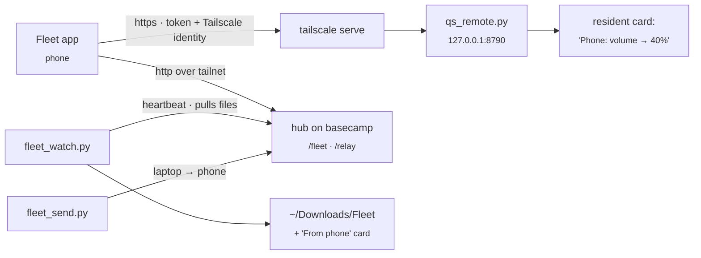

# Fleet: phone app, remote control, file relay

The **Fleet** Android app ([cybutr/fleet-app](https://github.com/cybutr/fleet-app)) controls this laptop and shows every machine on the tailnet. This page covers the laptop's side. The app and the hub on basecamp live in that repo.

## What runs on the laptop

| Piece | Does |
|---|---|
| `scripts/quickshell/claude/qs_remote.py` | The phone's API: `/api/v1/state` (volume, mute, mic, brightness, night light, power profile, battery, Wi-Fi, now playing with album colours), `/api/v1/art`, and `/api/v1/action/<name>`. It also serves the small `/m` browser page as a fallback. Every action shows a low-key "Phone: …" card and goes to `~/.local/state/qs-remote/audit.jsonl`. |
| `scripts/quickshell/claude/fleet_watch.py` | Pushes the laptop's heartbeat to the hub, writes `/tmp/qs_fleet.json` for the bar, and **pulls files the phone sent** into `~/Downloads/Fleet` with a "From phone" card (Open / Show in folder). |
| `scripts/quickshell/claude/fleet_send.py FILE` | Sends a file to the phone. Also in the palette as **Send a file to the phone**. |

## Set up once

1. Expose qs-remote on the tailnet: `tailscale serve --bg 8790`.
2. Give the phone a hub token. Add `phone:<token>` to the hub's `FLEET_DEVICE_TOKENS`, and add `FLEET_TOKEN_PHONE=<token>` to `~/.local/state/fleet/tokens.env`. To generate one: `python3 -c 'import secrets; print(secrets.token_urlsafe(32))'`.
3. Pair: palette › **Pair the Fleet app** (or `python3 scripts/quickshell/claude/qs_remote.py pair`). Open the `fleet://setup?…` link on the phone. The link contains tokens, so don't paste it into chats.

## Switches

| `settings.json` | Default | |
|---|---|---|
| `qsRemoteEnabled` | `true` | Kill switch, read on every request, so no restart is needed. Also in the palette as "Phone remote control". |
| `qsRemoteRequireIdentity` | `true` | Reject requests without a Tailscale identity header. Tagged nodes (the VPS, the Windows box) never send one. |
| `qsRemoteAllowedLogins` | `[]` | If set, only these Tailscale logins are allowed. |

## What the phone can do

Media (play/pause, next, previous), volume, mute, mic, brightness, night light, power profile, shuffle wallpaper, lock, notify, show a card, open a widget. Nothing else exists, and nothing takes a shell command. If the phone is lost: set `qsRemoteEnabled` to `false`, delete `~/.local/state/qs-remote/token` and restart qs-remote, then remove `phone:` from the hub's tokens.

## Tailscale key card

The resident's Tailscale card now follows each device's **node key** expiry (`KeyExpiry` in `tailscale status --json`). That's what actually drops a device off the tailnet. It names the soonest device and lists every device due within 14 days. The reusable **auth key** (`TAILSCALE_AUTHKEY_EXPIRY` in `resident_extras.py`) only limits adding new devices, so it gets a quiet card of its own.
