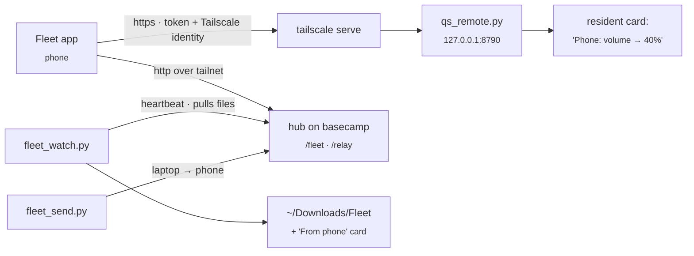

# Fleet: phone app, remote control, file relay

The **Fleet** Android app ([cybutr/fleet-app](https://github.com/cybutr/fleet-app)) controls this laptop and shows every machine on the tailnet. This page covers the laptop's side. The app and the hub on basecamp live in that repo.

## What runs on the laptop

| Piece | Does |
|---|---|
| `scripts/quickshell/claude/qs_remote.py` | The phone's API: `/api/v1/state` (volume, mute, mic, brightness, night light, power profile, battery, Wi-Fi, Bluetooth, do not disturb, stay awake, workspaces, keyboard layout, now playing with album colours and BPM), `/api/v1/art`, `/api/v1/action/<name>`, `/api/v1/binds` and `/api/v1/answer`. It also serves the small `/m` browser page as a fallback. Most actions show a low-key "Phone: …" card, and all go to `~/.local/state/qs-remote/audit.jsonl`. |
| `scripts/quickshell/claude/qs_remote_input.py` | The touchpad and keyboard: a WebSocket at `/api/v1/input`. Pointer moves, clicks, scrolls and keys go to ydotoold's socket as raw input events, and text goes through `wtype`. |
| `scripts/quickshell/claude/fleet_watch.py` | Pushes the laptop's heartbeat to the hub, writes `/tmp/qs_fleet.json` for the bar, and **pulls files the phone sent** into `~/Downloads/Fleet` with a "From phone" card (Open / Show in folder). |
| `scripts/quickshell/claude/fleet_send.py FILE` | Sends a file to the phone. Also in the palette as **Send a file to the phone**. |

## Set up once

The touchpad needs ydotoold running. On Arch it is a user service: `systemctl --user enable --now ydotool` (skip it if `pgrep ydotoold` already shows one). Typing works best with `wtype` installed (`sudo pacman -S wtype`), which handles any keyboard layout and Unicode.

1. Expose qs-remote on the tailnet: `tailscale serve --bg 8790`.
2. Give the phone a hub token. Add `phone:<token>` to the hub's `FLEET_DEVICE_TOKENS`, and add `FLEET_TOKEN_PHONE=<token>` to `~/.local/state/fleet/tokens.env`. To generate one: `python3 -c 'import secrets; print(secrets.token_urlsafe(32))'`.
3. Pair: palette › **Pair the Fleet app** (or `python3 scripts/quickshell/claude/qs_remote.py pair`). Open the `fleet://setup?…` link on the phone. The link contains tokens, so don't paste it into chats.

## Switches

| `settings.json` | Default | |
|---|---|---|
| `qsRemoteEnabled` | `true` | Kill switch, read on every request, so no restart is needed. Also in the palette as "Phone remote control". |
| `qsRemoteRequireIdentity` | `true` | Reject requests without a Tailscale identity header. Tagged nodes (the VPS, the Windows box) never send one. |
| `qsRemoteAllowedLogins` | `[]` | If set, only these Tailscale logins are allowed. |
| `qsRemoteInputEnabled` | `true` | Touchpad, keyboard and keybinds. Checked on every message, so turning it off cuts a live session immediately. Also in the palette as "Phone touchpad & keyboard". |

## What the phone can do

- **Controls:**
  - media, volume and brightness (both follow the slider live), mute, mic
  - night light, power profile
  - Wi-Fi, Bluetooth, do not disturb, stay awake (pauses hypridle)
  - switch workspace, screen on/off, screenshot to the phone, next keyboard layout
  - open a widget, lock, notify, show a card
- **Touchpad and keyboard** (the Pad tab):
  - Pointer, clicks, two-finger scroll, tap-and-drag.
  - Three- and four-finger swipes do what they do on the laptop's touchpad.
  - Typing, special keys and modifiers.
  - Any of the laptop's own keybinds. The phone picks a keybind by its id, and the laptop checks it against its own list, so the phone never chooses what runs.
- **Kahoot:** send a photo of a quiz question to `/api/v1/answer` and get the answer back. Fast mode uses Haiku and accurate mode uses Sonnet, with the key in `~/.config/anthropic/accounts/`.

Apart from the touchpad and keyboard, nothing takes a shell command. If the phone is lost:
1. Set `qsRemoteEnabled` to `false`.
2. Delete `~/.local/state/qs-remote/token` and restart qs-remote.
3. Remove `phone:` from the hub's tokens.

## Tailscale key card

The resident's Tailscale card now follows each device's **node key** expiry (`KeyExpiry` in `tailscale status --json`). That's what actually drops a device off the tailnet. It names the soonest device and lists every device due within 14 days. The reusable **auth key** (`TAILSCALE_AUTHKEY_EXPIRY` in `resident_extras.py`) only limits adding new devices, so it gets a quiet card of its own.
