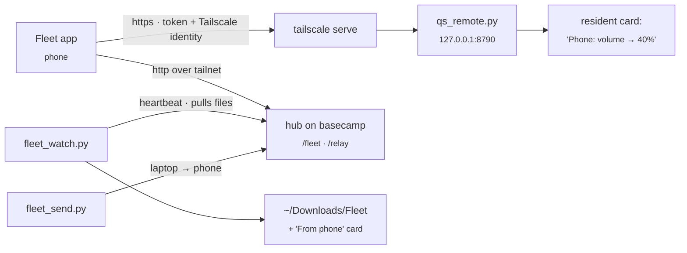

# Fleet: phone app, remote control, file relay

The **Fleet** Android app ([cybutr/fleet-app](https://github.com/cybutr/fleet-app)) controls this laptop and shows every machine on the tailnet. This page covers the laptop's side. The app and the hub on basecamp live in that repo.

## Planned: laptop → phone screen streaming (not started, scoped 2026-10-02)

User wants to watch the laptop's screen live on the phone, WebRTC-grade latency, not a polled screenshot. Real feature, real lift — scoped here, not built.

**Capture (laptop side):** Hyprland is wlroots-based, so screen capture goes through the `wlr-screencopy` protocol (what `grim`/OBS's wlroots backend already use) or PipeWire's ScreenCast portal (what browsers use for wlroots screen-share — likely the cleaner path since it's already negotiated by `xdg-desktop-portal-hyprland`, which this rice almost certainly has for screenshot/record support — check `screenshot.sh`'s existing capture mechanism first and reuse whatever it already talks to rather than standing up a second capture path). Encode with a hardware encoder if available (this laptop has an NVIDIA dGPU, check NVENC availability via `ffmpeg -encoders | grep nvenc`; software x264 as fallback) via GStreamer's `webrtcbin` or a small Python `aiortc` process — GStreamer's `webrtcbin` is the more production-proven path for a wlroots→WebRTC pipeline, `aiortc` is easier to wire into the existing Python daemon pattern this repo already uses everywhere (`qs_remote.py` etc) at the cost of pure-Python encoding being slower.

**Signaling:** reuse the existing `qs_remote.py` WebSocket pattern (it already has one for the touchpad/keyboard relay, `qs_remote_input.py`) — a small signaling exchange (SDP offer/answer, ICE candidates) over a new `/api/v1/stream` WS endpoint, same auth model (bearer token + Tailscale identity) as everything else. Since both ends are always on the same tailnet, ICE is simple — no public STUN/TURN needed, candidates will just be the tailnet IPs directly (100.x addresses), which keeps this fully private with no new attack surface.

**Phone side:** the Android app already has a Compose UI and talks to the laptop over the same tailnet — add a WebRTC client (`org.webrtc:google-webrtc` or the newer `io.getstream:stream-webrtc-android` fork, since Google stopped publishing the artifact) and a new screen that renders the incoming video track, triggered by a button next to the existing Pad/Controls/Kahoot tabs (or folds into Pad as a "watch" mode, since you're often already there to control the laptop — avoid an unnecessary new top-level tab per the "don't add useless new tabs" instruction from the Controls-screen work).

**Why this is a real lift, not a quick add:** WebRTC needs correct SDP/ICE negotiation, a capture→encode→RTP pipeline that behaves under real network jitter even on a private tailnet, and an Android WebRTC dependency that's historically been fiddly to keep building (Google's artifact churn is why there's already a fork recommendation above). Budget this as its own multi-session build, not a bolt-on — same tier of effort as the Android app itself was.

**Suggested order:** 1) verify capture + encode works locally on the laptop first (capture → encode → write to a local file, confirm the pipeline itself is sound before any networking) 2) wire the signaling WS + a trivial two-tab-in-one-browser WebRTC test to prove the laptop-side offer/answer logic works at all 3) only then build the Android client.

## What runs on the laptop

| Piece | Does |
|---|---|
| `scripts/quickshell/claude/qs_remote.py` | The phone's API: `/api/v1/state` (volume, mute, mic, brightness, night light, power profile, battery, Wi-Fi, Bluetooth, do not disturb, stay awake, workspaces, keyboard layout, now playing with album colours and BPM), `/api/v1/art`, `/api/v1/action/<name>`, `/api/v1/binds` and `/api/v1/answer`. It also serves the small `/m` browser page as a fallback. Most actions show a low-key "Phone: …" card, and all go to `~/.local/state/qs-remote/audit.jsonl`. |
| `scripts/quickshell/claude/qs_remote_input.py` | The touchpad and keyboard: a WebSocket at `/api/v1/input`. Pointer moves, clicks, scrolls and keys go to ydotoold's socket as raw input events, and text goes through `wtype`. |
| `scripts/quickshell/claude/fleet_watch.py` | Pushes the laptop's heartbeat to the hub, writes `/tmp/qs_fleet.json` for the bar, and **pulls files the phone sent** into `~/Downloads/Fleet` with a "From phone" card (Open / Show in folder). |
| `scripts/quickshell/claude/fleet_send.py FILE` | Sends a file to the phone. Also in the palette as **Send a file to the phone**. |

## Set up once

The touchpad needs ydotoold running. On Arch it is a user service: `systemctl --user enable --now ydotool` (skip it if `pgrep ydotoold` already shows one). Typing works best with `wtype` installed (`sudo pacman -S wtype`), which handles any keyboard layout and Unicode.

1. Expose qs-remote on the tailnet: `tailscale serve --bg 8790`.
2. Give the phone a hub token. Add `phone:<token>` to the hub's `FLEET_DEVICE_TOKENS`, and add `FLEET_TOKEN_PHONE=<token>` to `~/.local/state/fleet/tokens.env`. To generate one: `python3 -c 'import secrets; print(secrets.token_urlsafe(32))'`.
3. Pair: palette › **Pair the Fleet app** (or `python3 scripts/quickshell/claude/qs_remote.py pair`). Open the `fleet://setup?…` link on the phone. The link contains tokens, so don't paste it into chats.

## Switches

| `settings.json` | Default | |
|---|---|---|
| `qsRemoteEnabled` | `true` | Kill switch, read on every request, so no restart is needed. Also in the palette as "Phone remote control". |
| `qsRemoteRequireIdentity` | `true` | Reject requests without a Tailscale identity header. Tagged nodes (the VPS, the Windows box) never send one. |
| `qsRemoteAllowedLogins` | `[]` | If set, only these Tailscale logins are allowed. |
| `qsRemoteInputEnabled` | `true` | Touchpad, keyboard and keybinds. Checked on every message, so turning it off cuts a live session immediately. Also in the palette as "Phone touchpad & keyboard". |

## What the phone can do

- **Controls:**
  - media, volume and brightness (both follow the slider live), mute, mic
  - night light, power profile
  - Wi-Fi, Bluetooth, do not disturb, stay awake (pauses hypridle)
  - switch workspace, screen on/off, screenshot to the phone, next keyboard layout
  - open a widget, lock, notify, show a card
  - scratchpad (the `magic` special workspace), eco mode, Claude quiet, the "yo kandor" wake word
- **Palette:** the search bar at the top of Controls. `/api/v1/palette` takes `{"q", "ask"}` and returns matching rows from the laptop's own palette index (`palette_index.py`), plus a Claude route when `ask` is true. `/api/v1/palette/run` takes `{"id", "arg", "confirm"}` and runs a row by id; dangerous rows need `confirm`. Free text only goes to rows built for it (ask Claude, Spotify search, open a site, open an app on a workspace, rename a workspace, mail search), and the remote's own switches and `fleet.*` rows can't be run from the phone. It is part of the touchpad and keyboard switch.
- **Quick settings tiles** in the phone's own shade: laptop music (play/pause), laptop sound (mute) and lock laptop. They only talk to the laptop when the shade is open or a tile is tapped.
- **Touchpad and keyboard** (the Pad tab):
  - Pointer, clicks, two-finger scroll, tap-and-drag.
  - Three- and four-finger swipes do what they do on the laptop's touchpad.
  - Typing, special keys and modifiers.
  - Any of the laptop's own keybinds. The phone picks a keybind by its id, and the laptop checks it against its own list, so the phone never chooses what runs.
- **Kahoot:** send a photo of a quiz question to `/api/v1/answer` and get the answer back. Fast mode uses Haiku and accurate mode uses Sonnet, with the key in `~/.config/anthropic/accounts/`.

Apart from the touchpad, keyboard and palette, nothing takes a shell command. If the phone is lost:
1. Set `qsRemoteEnabled` to `false`.
2. Delete `~/.local/state/qs-remote/token` and restart qs-remote.
3. Remove `phone:` from the hub's tokens.

## Tailscale key card

The resident's Tailscale card now follows each device's **node key** expiry (`KeyExpiry` in `tailscale status --json`). That's what actually drops a device off the tailnet. It names the soonest device and lists every device due within 14 days. The reusable **auth key** (`TAILSCALE_AUTHKEY_EXPIRY` in `resident_extras.py`) only limits adding new devices, so it gets a quiet card of its own.
