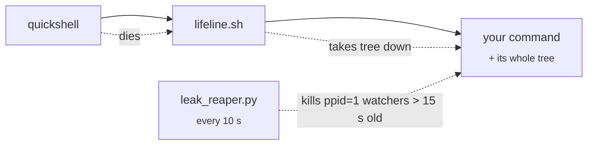

# Performance

## Leak-proof processes

**The problem this solves:** when Quickshell restarts, it kills only a `Process`'s *direct* child. Every `inotifywait | while read …`, `sleep` loop, `playerctl --follow` and `dbus-monitor` below that survived as an orphan. After a day of restarts that added up to 1000+ processes and a load average over 40.

- **`scripts/quickshell/lifeline.sh`** wraps every long-lived `Process { command: [...] }`, so the tree dies with its parent. **New watchers must use it.**
- **`scripts/leak_reaper.py`** is the backstop. It logs to `/tmp/qs_leak_reaper.log`.
- **`scripts/kill_orphans.sh`** is a manual one-shot sweep that prints before/after counts.

## Eco mode

`scripts/eco_daemon.py` throttles or freezes background apps using per-class rules in `eco/rules.json` (hot-reloaded).

| Policy | Trigger | Mechanism | Typical apps |
|---|---|---|---|
| `never` | — | — | Terminals, Quickshell, anything focused, fullscreen, urgent, playing audio or capturing |
| `throttle` | `ecoThrottleSecs` unfocused (20 s) | CPU quota via a `systemd --user` scope | Spotify (never frozen, because audio) |
| `freeze` | `ecoFreezeSecs` hidden on another workspace (300 s) | cgroup freeze | Telegram, idle browsers, Steam helpers |

Every freeze is guaranteed a thaw, both on exit and by a startup sweep after a crash. Live state is in `/tmp/qs_eco_state.json`. It shows in the bar as a cyan breathing tint (throttled) or ice-blue frost (frozen) on workspace pills, with details in the workspace hover card.

`eco/zz-*.rules` are separate ananicy-cpp rules (nice/ionice) at a different layer.

## Widget latency

- `qs_manager.sh` writes the open command **first** and runs its watchdog afterwards, at most once every 30 s.
- `Main.qml` preloads about 15 widgets in the background (Claude Ask and Guide first).
- The Guide's tabs lazy-load (`Loader { active: loadedTabs[n] }`).

The Quickshell CPU chip (`topBarShowQuickshellCpu`, fed by `perf_watch.py`) shows the shell's own CPU use next to your apps. If it runs hot for a while, you get a "Bar running hot" card.

## System tweaks (opt-in)

`scripts/apply_power_tweaks.sh` is never auto-run. Read it, then run `sudo bash scripts/apply_power_tweaks.sh`. Each block documents its own revert.

| Block | Notes |
|---|---|
| Nvidia runtime PM | Lets the dGPU deep-sleep. Needs a reboot. Check with `cat /proc/driver/nvidia/gpus/*/power` |
| 80% charge cap | `thinkpad_acpi`, systemd oneshot |
| earlyoom, irqbalance | |
| ananicy-cpp rules | Heavy apps, Spotify |
| auto-cpufreq | **Commented out.** It replaces power-profiles-daemon, which eco mode and the bar depend on |

Already investigated, don't retry: PCIe ASPM (firmware refuses; `pcie_aspm=force` risks NVMe stability) and swappiness / vfs_cache_pressure (already tuned by `cachyos-settings`).
