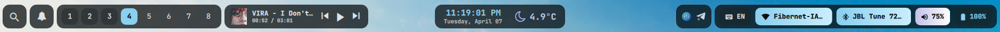

# Top bar



`scripts/quickshell/TopBar.qml`. One instance per monitor. On a desktop (no `/sys/class/power_supply/BAT*`) it hides Bluetooth, shows Ethernet, and swaps the battery pill for a power button.

| Zone | Pills |
|---|---|
| **Left** | Search · Notifications · Workspace pills (smart names, eco tint) · Now playing (cover, title, controls, FFT visualizer) |
| **Center** | Clock + date · Weather · Timer · Claude status |
| **Right** | Tray · Keyboard layout · Wi-Fi / Ethernet · Bluetooth · Volume · Battery · optional stats chips (CPU, GPU, net, uptime, Quickshell CPU) |

## Hover cards

Hover any pill for about a second and a card grows flush out of it. The pill's corners square off to meet it.

| Pill | Card |
|---|---|
| Weather | Current conditions, hourly strip, 5-day forecast |
| Clock | Today's real agenda (from `schedule_manager.sh`) |
| Media | Full player with synced lyrics |
| Workspaces | Windows per workspace, smart-ws name/icon/cycle, saved layouts, eco section |
| Volume | Slider, per-app mixer, output switch |
| Wi-Fi / Bluetooth | Networks or devices, click to connect or disconnect |
| Battery | State, time to full or empty, power draw in watts, power profile |
| Stats | Live history for CPU, GPU, network and uptime |

The implementation pattern (reparenting, the input-mask `Region`, open delay and close grace) is documented in `CLAUDE.md` under *Hover Card System*. Copy an existing card like `volTip` rather than starting fresh.

## Pill backgrounds

Ambient effects drawn behind the pill contents, clipped to the rounded pill shape. Each one is `always`, `occasional` or `never`, under **Guide → Settings → Pill backgrounds** (master switch: `topBarPillBgMaster`).

| Effect | Setting | Preview keyword |
|---|---|---|
| Battery liquid fill | `topBarBatteryLiquidMode` | `batteryfill` |
| Volume fill | `topBarVolumeFillMode` | `volumefill` |
| Sky (time of day + weather) | `topBarSkyMode` | `skyfx` |
| Wi-Fi radar rings | `topBarWifiRadarMode` | `wififx` |
| Bluetooth connect pulse | `topBarBtPulseMode` | `btfx` |
| CPU/GPU load area | `topBarCpuAreaMode` | `cpufx` |
| Net up/down particles | `topBarNetParticlesMode` | `netfx` |
| Uptime constellation | `topBarUptimeStarsMode` | `uptimefx` |
| Workspace app tint | `topBarWorkspaceTintMode` | `wsfx` |
| Claude aurora | `topBarClaudeAuroraMode` | `claudefx` |

Preview one without waiting for the real conditions:

```bash
echo skyfx > /tmp/qs_topbar_test_flourish
```

## Timer pill

A compact countdown pill with no icon.

| Input | Action |
|---|---|
| Left-click | Start (when idle) |
| Right-click | Pause / resume |
| Double-click, then click again within 3 s | Stop |
| Wheel | ±1 minute |
| <kbd>Ctrl</kbd> + wheel | ±1 hour (Ctrl is read from evdev by `scripts/ctrl_watch.py`, because the bar never has keyboard focus) |

State persists across restarts in `/tmp/qs_timer.json`. It's scriptable too:

```bash
echo "set 25" > /tmp/qs_timer_cmd && echo start > /tmp/qs_timer_cmd
```

## Resident cards

The queue-driven card that drops under the clock pill. See [claude-resident.md](claude-resident.md#cards).
