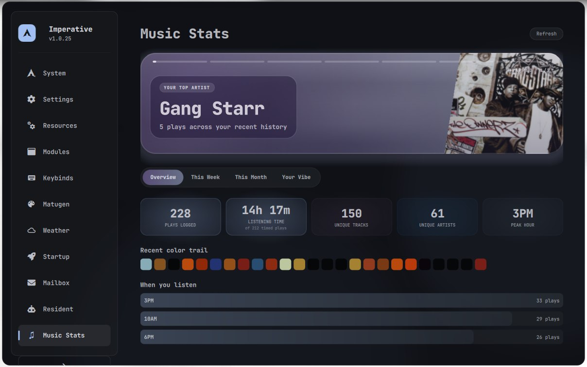
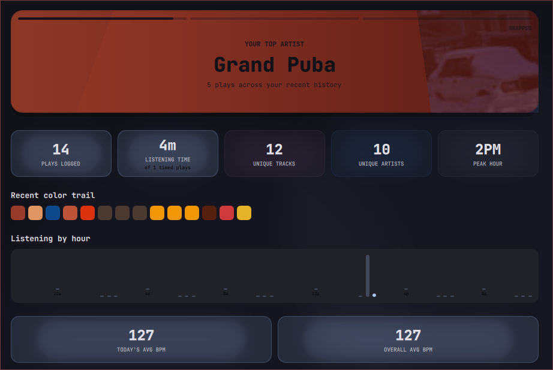
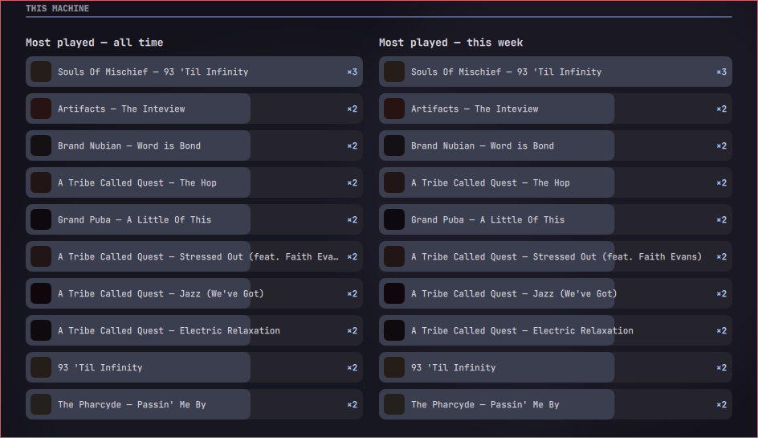
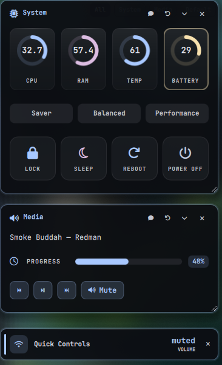

# Widgets

Every popup lives in the single `Main.qml` window and is swapped in by `qs_manager.sh`. Sizes are at 1920 px wide and `uiScale: 1`. `WindowRegistry.js` scales them. See [architecture.md](architecture.md) for how switching works.

```bash
bash ~/.config/hypr/scripts/qs_manager.sh toggle <widget>   # or: open / close
```

---

## Music · `music`


`music/MusicPopup.qml` · 700×620, top-left · <kbd>Super</kbd> <kbd>M</kbd>

Any MPRIS player, with a spinning vinyl cover and a seek bar. The popup is frosted glass tinted by the album art. The EasyEffects-backed 10-band EQ has presets (Flat, Bass, Treble, Vocal, Pop, Rock, Jazz, Classic), and **My Presets** saves your own curves. Metadata comes from `music/music_info.sh`, with a DBus signal watcher for instant updates.

## Calendar & weather · `calendar`


`calendar/CalendarPopup.qml` · 1450×750, top-center · <kbd>Super</kbd> <kbd>Shift</kbd> <kbd>X</kbd>

Month grid, a big clock, and an hourly temperature arc. Day navigation shows wind, humidity, rain and feels-like gauges. The agenda strip at the bottom comes from `calendar/schedule/schedule_manager.sh`, and weather from `calendar/weather.sh`.

## Network · `network`


`network/NetworkPopup.qml` · 900×700, top-right · <kbd>Super</kbd> <kbd>N</kbd>

A radar layout of nearby Wi-Fi networks or Bluetooth devices, switched with the tabs at the bottom. Click a device to connect or pair. Uses `nmcli` and `bluetoothctl`.

<table>
<tr>
<td width="50%">

## Battery · `battery`


`battery/BatteryPopup.qml` · 480×760 · <kbd>Super</kbd> <kbd>B</kbd>

Charge ring, uptime, brightness and volume sliders, quick lock/sleep/reboot/off, and power profile (Perform / Balance / Saver).

</td>
<td width="50%">

## Volume · `volume`


`volume/VolumePopup.qml` · 480×760 · <kbd>Super</kbd> <kbd>Shift</kbd> <kbd>V</kbd>

Default-sink ring, then tabs for outputs, inputs and per-app streams. Click a device to make it the default.

</td>
</tr>
</table>

## Focus time · `focustime`


`focustime/FocusTimePopup.qml` · 900×720, centered · <kbd>Super</kbd> <kbd>Shift</kbd> <kbd>T</kbd>

Screen time per app, tracked by `focustime/focus_daemon.py`: daily average, today's total, change versus yesterday, a weekly bar chart and a month heatmap.

## Monitors · `monitors`


`monitors/MonitorPopup.qml` · 850×580, centered · <kbd>Super</kbd> <kbd>Shift</kbd> <kbd>M</kbd>

Resolution presets and a refresh-rate slider for each output, applied through `hyprctl`.

## Wallpaper · `wallpaper`


`wallpaper/WallpaperPicker.qml` · full width × 650 · <kbd>Super</kbd> <kbd>W</kbd>

A carousel over `wallpaperDir`, filtered by dominant color. Picking a wallpaper sets it with `awww` (or `mpvpaper` for video) and runs `wallpaper/matugen_reload.sh`, which re-themes the whole shell within about a second.

---

## Guide · `guide`


`guide/GuidePopup.qml` · 1200×750, centered · <kbd>Super</kbd> <kbd>Shift</kbd> <kbd>H</kbd>

The "Imperative" control center. The sidebar holds **System, Settings, Resources, Modules, Keybinds, Matugen, Weather, Startup, Mailbox, Resident** and **Music Stats**. Settings is a searchable, collapsible list of every `settings.json` key, grouped by category, with an Apply button (see [settings.md](settings.md)). Tabs lazy-load.

### Music Stats

A Spotify-Wrapped-style recap computed by `music/music_stats.py` from `play_history.jsonl` (logged by `music_info.sh`) and Spotify history. Open it straight to a tab with `qs_manager.sh open guide musicstats-week` (also `-month`, `-vibe`).


<table>
<tr>
<td width="50%"><br><sub>Overview: top artist, totals, recent color trail, when you listen</sub></td>
<td width="50%"><br><sub>Top artist, plays, unique tracks, peak hour, BPM</sub></td>
</tr>
</table>


<sub>Your Vibe: listener type ("The Marathoner") and listening DNA (night owl, early riser, replay, loyalty)</sub>



## Claude Ask · `claudeask`


`claude/ClaudeAsk.qml` · 920×720, centered · <kbd>Super</kbd> <kbd>`</kbd>

Chat with the resident. <kbd>Shift</kbd>+<kbd>Tab</kbd> cycles the mode, and the chips show the model and auto mode. Ask for a dashboard and Claude builds **pinned cards** (`PinnedCards.qml` / `CardRenderer.qml`, through the `qs_mcp.py` pin tools). Here that's system gauges with power actions, media, and quick controls:



## Lock screen


`Lock.qml`, launched by `lock.sh`. Settings are under **Guide → Settings → Lock screen**. Preview without locking: `bash ~/.config/hypr/scripts/lock_test.sh` (password `test`).

## Without screenshots (yet)

| Widget | Keys | File | Notes |
|---|---|---|---|
| `applauncher` | <kbd>Super</kbd> <kbd>A</kbd> | `applauncher/appLauncher.qml` | 800×700, centered |
| `clipboard` | <kbd>Super</kbd> <kbd>V</kbd> | `clipboard/ClipboardManager.qml` | cliphist-backed, text and images |
| `quicktell` | <kbd>Super</kbd> <kbd>G</kbd> | `claude/QuickTell.qml` | One-line prompt, voice with <kbd>Alt</kbd> |
| `quicksettings` | <kbd>Super</kbd> <kbd>U</kbd> | `quicksettings/QuickSettingsDrawer.qml` | Toggle tiles, slides up from the bottom |
| `notifications` | <kbd>Super</kbd> <kbd>Shift</kbd> <kbd>A</kbd> | `notifications/NotificationCenter.qml` | Legacy or revamp, see `widgetStyles` |
| `workspaces` | <kbd>Super</kbd> <kbd>Shift</kbd> <kbd>W</kbd>, <kbd>Alt</kbd> <kbd>Tab</kbd> | `WorkspaceOverview.qml` | Full screen with live thumbnails |
| `power` | <kbd>Super</kbd> <kbd>Shift</kbd> <kbd>E</kbd> | `power/PowerMenu.qml` | Hold-to-confirm lock / sleep / reboot / shutdown |
| `stewart` | — | `stewart/stewart.qml` | 800×600, centered |

Add one with `bash scripts/docs/capture.sh <widget>`. It needs a crop box in `scripts/docs/build_assets.py`.

## Adding a widget

1. Add an entry to `getLayout()` in `scripts/quickshell/WindowRegistry.js` with `w`, `h`, `rx`, `ry` and `comp`.
2. Create the QML component at that `comp` path.
3. Bind it in `hyprland.conf`: `bind = $mainMod, X, exec, bash ~/.config/hypr/scripts/qs_manager.sh toggle <name>`.

Any long-running `Process` inside it **must** go through `lifeline.sh` (see [performance.md](performance.md)).
